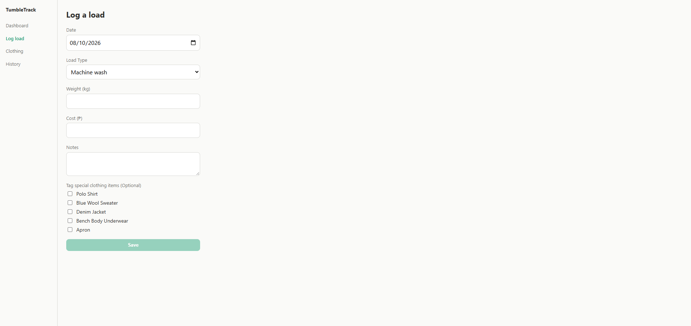

# TumbleTrack - Mockup
TumbleTrack is a lightweight laundry-tracking application designed for dorm students and young adults living independently who manage their own laundry routines. The application provides an intuitive interface to log individual wash loads, monitor weekly spending, and maintain an inventory of delicate or special garments to ensure they are washed on schedule without being over-washed.

# Desktop Viewport

### Dashboard Screen

### Log a Load Screen

### Clothing Screen

### Add a Clothing Item Modal

### History Screen

***

# Mobile Viewport

### Dashboard Screen

### Log a Load Screen

### Clothing Screen

### Add a Clothing Item Modal

### History Screen

***
